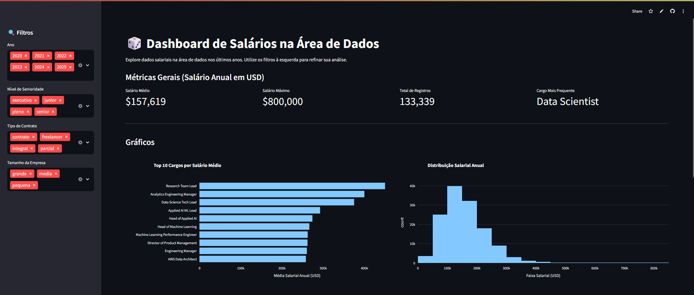

# Imersão Dados com Python (Alura)

Repositório com os arquivos utilizados na Imersão de Dados com Python, promovida pela Alura. Aqui você encontrará código, dados e instruções para rodar o projeto localmente.

---

##  Estrutura de arquivos

- `app.py` — Script principal em Python, contém a lógica da aplicação.
- `dados-imersao-final.csv` — Conjunto de dados final utilizado no projeto.
- `requirements.txt` — Dependências necessárias para executar o projeto.
- `README.md` — Este arquivo, com instruções de uso.

---

##  Pré-requisitos

- Python 3.x instalado em sua máquina
- Virtualenv (ou `venv`) para criar um ambiente virtual (recomendado)

---

##  Instruções de uso

### 1. Clone o repositório

git clone https://github.com/victordlmoraes/imersao-dados-python-alura.git
cd imersao-dados-python-alura

### 2. Crie e ative o ambiente virtual

- Unix/MacOS:
  - ``python3 -m venv venv``
  - ``source venv/bin/activate``

- Windows:
  - ``python -m venv venv``
  - ``.\venv\Scripts\Activate`` ou ``.\.venv\Scripts\Activate.ps1``

### 3. Instale as dependências

``pip install -r requirements.txt``

### 4. Execute o projeto

``streamlit run app.py``

### 5. Acesse os resultados

Será inicializado um servidor (via Streamlit), o navegador será inicializado nos endereços de acesso http://localhost:5000 ou http://localhost:8501.

---

## Visualização do Projeto

Este projeto está hospedado na plataforma do Streamlit. Clique no link a seguir para visualizar:
https://victordlmoraes-imersao-dados-python-alura.streamlit.app/

## Imagens do Projeto

